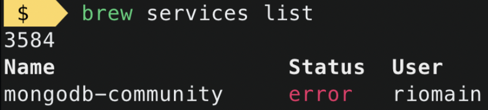

## 安装流程

1. install home brew
2. `brew tap mongodb/brew`
3. `brew install mongodb-community@5.0`
4. `brew services list`

## 坑

### Two ways to start service

根据[mongodb文档](https://docs.mongodb.com/manual/tutorial/install-mongodb-on-os-x/), step 3和step 4中间还有一步 `brew services start mongodb-community@5.0`. 

我们首先需要知道mongodb有两部分构成, server和client. 开启server的命令为 `mongod (other parameters...)`, 开启client的命令为`mongo`. 

而官网所说的`brew services start mongodb-community@5.0` 其实会直接运行default mongod command. 而默认的server db存储位置为`/data/db`.  `/` 是mac的read-only space, 我们不可以在这里mkdir, 而他本来就没有/data/db这个folder, 所以我们运行官网给出的`brew services start mongodb-community@5.0` 后再运行 `brew services list` 就会显示 3584 error.



### Fail to stop service

当使用`brew services start mongodb-community@5.0` 时我们可以用 `brew services stop mongodb-community@5.0` 停止server.

当使用 `mongod (other parameters..)`时我们有两种方法停止server.

- Ctrl+C on the terminal which is running mongod
- open a new terminal
  - type `mongo` and hit enter
  - `use admin`
  - `db.shutdownServer()`

## 填坑

很简单, 不使用brew services start即可. 我们可以使用`sudo mkdir -p /System/Volumes/Data/data/db ` 在可写区域创建好db储存的文件夹. 然后用`sudo mongod --dbpath /System/Volumes/Data/data/db` 指定server运行时的数据位置. 这时使用`brew services list` 则会显示service status started. 之后就可以打开另一个terminal开启client了!

注意: 在做这些事前请确保没有正在运行的mongod(server service).

## 卸载流程

1. `launchctl list | grep mongo` to check the running mongo service
2. `launchctl unload ~/Library/LaunchAgents/homebrew.mxcl.mongodb.plist` based on which file exists in `~/Library/LaunchAgents`
3. `rm -f ~/Library/LaunchAgents/homebrew.mxcl.mongodb.plist`
4. `launchctl remove homebrew.mxcl.mongodb`
5. `pkill -f mongod`  Kill all the processes related to mongod
6. `brew uninstall mongodb`
7. `rm -rf /opt/homebrew/var/mongodb` Data Directory
8. `brew cleanup -s mongodb-community`
9. `brew cleanup --prune-prefix`

## Resource

```
https://docs.mongodb.com/manual/tutorial/manage-mongodb-processes/
https://www.mongodb.com/community/forums/t/help-brew-mongodb-community-5-0-error-macos/125648
https://docs.mongodb.com/manual/tutorial/install-mongodb-on-os-x/
https://rajanmaharjan.medium.com/uninstall-mongodb-macos-completely-d2a6d6c163f9
```

