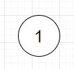
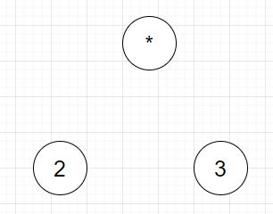
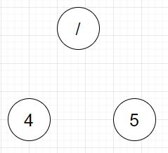
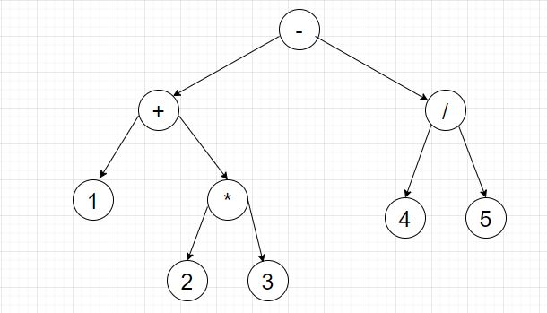

### 起因
因为最近学了一点js, 准备做几个项目练练手, 就盯上了万年老坑计算器. 说他坑主要是因为可易可难, 如果要加上很多科学计算器的功能估计会很麻烦. 于是我就准备做一个只有最基础四则运算功能的版本. 看了几篇给js初学者看的文章发现基本都是先从基本逻辑讲起, 再不断往上堆功能最后再考虑边际情况. 感觉这种方法又啰嗦又不robust, 就突然想起了大一课上学过一个叫逆波兰表达式的东西(Reverse Polish notation), 貌似能很方便的计算任意的一个expression, 然后我就把js扔在了一边开始研究怎么把给出的一个数学expression转换成RPN形式.

### 逆波兰表达式(RPN)
逆波兰表达式中的所有符号都在第二个操作数的后面
EX:
1 2 3 + *
在这个表达式里, +号在3后面, 所以+连接2和3, 而\*号在2和3后面, 所以\*号连接1和(2+3).
使用stack后RPN的计算可以变得非常方便, 具体计算一个RPN值的方法是:
依次把token放进stack, 遇到operator时把入栈的token数字都拿出并且用operator连接求值, 将值放进stack. 遍历过一遍RPN后, stack顶的值就是这个RPN的值.

#### 问题
但是使用RPN计算一个表达式的值有一个问题, 就是如何把普通的expression又称中缀表达式转换成RPN. Wikipedia告诉我可以用一个叫调度场算法的方法来convert. 但由于其适应性不够(只能用在RPN问题中)而且貌似很难证明, 遂放弃. 而这个时候我发现了parser的存在.

### Parser
根据[王垠的文章](https://www.yinwang.org/blog-cn/2015/09/19/parser), parser是能把文本转换成一种叫抽象语法树(AST)的数据结构的工具. 对于1+2这样的表达式, 计算机无法直接对其计算, 而要通过AST来计算他的值. 
对于1+2这样的数学表达式来说AST是一个二叉树, 每一个node代表了一个操作符, 而二叉树的leaf则为最初始的操作数. //TODD: add img

因此一个中缀表达式可以被转换成由操作符和操作数组成的无括号的二叉树, 而有了这棵二叉树, 中缀转RPN将会变得非常简单. 更简单的是我可以通过遍历这棵树来直接求得中缀expression的答案. 而parser要干的事, 就是自动地把任意一个expression转换成这棵AST. 

#### 算法

于是问题就变成了如何造出一个parser, which能接受任意的带括号的四则运算表达式, 并且能输出一棵AST. 

通过[轮子哥的博客](http://www.cppblog.com/vczh/archive/2008/06/15/53373.html), 我了解到一般编译器中用到的parser都是用一种叫递归下降的算法写的.

我们可以先分析一下一个expression的语法. 一个expression: 1+2*(3+4)/*5+6/7-8, 我们可以把他分成三个部分, 一是最简单的term. 一个term可以是一个数字, 也可以是由()围起来的一个expression, 这么分是因()的值和数字值地位相同. 

其次我们可以把由\*或/连接的元素称为factor. 在例子中, 2\*(3+4)/5就是一个factor, 这么分的原因是可以观察到所有factor中的被\*或/连接的元素都是一个term, 如2, (3+4) 和 5. 要注意的是, 在实现的过程中, 要考虑只有一个term而不需要\*或/来连接的情况,　这种情况下, 我们也称这个term为factor.

最后, 我们可以把由+或-连接的元素称为expression. 在例子中如1+2(3+4)/5+6/7-8, 和3+4这样的都被称为expression. 这么划分expression的原因是由+或-直接连接的元素都是factor. 要注意的是, 在实现过程中, 要考虑只有一个term而不需要\+或-来连接的情况, 这种情况下, 我们也称这个factor为expression. 

如 ”1“ 这个表达式, 他不需要加减号来连接, 因此他自己就是一个expression, 也是一个factor. 而他也没有乘除号来连接因此他也是一个term.

通过这种划分方法来递推expression的方法是这样的:

EX: 1+2\*3-4/5

这是一个expression, 含有3个factors, 分别是1, 2\*3和4/5. 1中含有一个纯数字term 1, 这时我们就到了AST的底端, 而这个leaf的值, 就是这个term的值1. 2\*3中含有两个纯数字term 2 和 3, 而2和3可以分别被存放在最低端的两个leaf中, 值分别是2和3. 而这两个leaf的father node, 则存放了连接这两个term的operator, 在这个例子中为\*. 4/5同理. 到目前为止,我们有了3个factor








向上一级, 考虑factor组成的expression. 程序先检测到factor1和2\*3, 然后1和\*的father node就变成了+. 程序继续考虑4/5也是factor, 于是+和/的father node变成了-.



#### 代码

我们先建一个node class作为存放node值的数据结构, 这个类中定义了该node是不是纯数字term, 他的左右child分别是什么, 以及如果不是leaf node, 他存放了什么operator:

```
struct Expression {
	bool Isnumber;
    int Number;
    char Operator;
    Expression *Left;
    Expression *Right;

    // arrive the bottom of the AST, only number on the node
    Expression(int aNumber) {
        Number = aNumber;
        Isnumber = true;
        Left = nullptr;
        Right = nullptr;
        Operator = 0;
    }

    // operator nodes of the AST
    Expression(char aOperator, Expression *left, Expression *right){
        Operator = aOperator;
        Left = left;
        Right = right;
        Isnumber = false;
        Number = 0;
    }
};
```

其中的构造函数分别是为后面建两种node准备的.


我们需要至少三个函数, 来依次检测expression, factor 和term, 如果term中又出现了expression, 则又需要调用检测expression的函数. 此外, 我们还需要检测term中是否是纯数字的函数, 如果是纯数字, 则需把数字存在leaf node中. 因此声明四个函数:

```
Expression *exp(char *&Stream);
Expression *factor(char *&Stream);
Expression *term(char *&Stream);
Expression *number(char *&Stream);
```

给出一个函数,　其他三个的实现方法类似

```
Expression *expr(char *&Stream) {
    char *Read = Stream;
    Expression *t = fact(Read);
    if (t) {
        Expression *result = t;

        while (true) {
            char sign = 0;
            if (comp(Read, "+")) {
                sign = '+';
            } else if (comp(Read, "-")) {
                sign = '-';
            } else {
                break;
            }
            Expression *next = fact(Read);
            if (next) {
                result = new Expression(sign, result, next);
            } else {
                return nullptr;
            }
        }
        Stream = Read;

        return result;
    } else {
        return nullptr;
    }
}
```

而最后遍历树求值的方法比较简单, 代码就不放了.

因为最近才开始学C++, 一些C++11的特性不是很熟悉, 很多还是用写C的经验写的. 代码等熟悉了还可以改进.

### 总结

这次主要是写了个最简单的parser, 然后解决了表达式计算值的问题, 其实也可以用这个parser转成RPN再求值, 不过那就要多一步stack操作的过程了. 网上的很多人说parser是实现编译器的第零步,这么看起来compiler也挺好玩的, 改天可以写个解析语言或者json这样文本的parser试试.